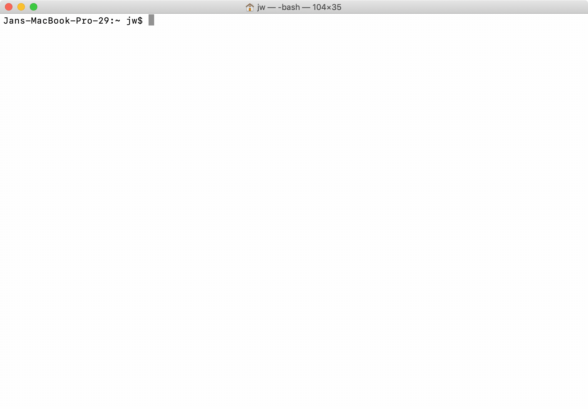

#  wfs - web file system

wfs is a virtual file system for parsing and retrieving web APIs. The implementation for each API is scriptable using JavaScript, see the `/examples` folder. The API results are mounted as a FUSE file system. Inspired by [Plan 9 webfs](https://9p.io/magic/man2html/4/webfs).

## Getting Started

### Installing

#### On Linux

- Ensure you have the latest version of Go and `fuse3` package installed.
- Run `go install github.com/autovia/wfs@latest`.

#### Setup

Create a .wfs directory in home for your scripts.

```bash
$ mkdir $HOME/.wfs
```

Create a folder to enter wfs.

```bash
$ mkdir $HOME/wfs
```

Mount and start wfs.

```bash
$ wfs mount $HOME/wfs
```

### Write your own scripts

For example you can search and browse Github:

[](https://github.com/autovia/wfs/blob/main/examples/github.js)

<p align="center">
  
</p>

#### How can I access xyz.com?

Write your own scripts like wikipedia.js. More examples see `/examples`.

```
/*
The search function is called when 'cd' into a directory.
*
* @param {String} query The query to search for. 
* @return {Array.<{type: String, name: String, url: String}>} result.
*/
function search(query) {
	var url = "https://en.wikipedia.org/w/api.php?action=query&list=search&srsearch=" + query + "&srlimit=50&format=json"
	var json = JSON.parse(httpGet(url));
	var result = [];
	json.query.search.forEach(function(elm) {
		var file = "https://en.wikipedia.org/w/api.php?format=json&action=query&prop=extracts&exlimit=1&explaintext&pageids=" + elm.pageid + "&&formatversion=2&redirects="
		result.push({type: "file", name: elm.title + ".txt", url: file, size: "4096"});
	});
	return result;
}

/*
The download function is called when opening a file.
*
* @param {String} url The url to load. 
* @return {String} The content of the file.
*/
function download(url) {
	var json = JSON.parse(httpGet(url));
	return json.query.pages[0].extract;
}
```

#### Core functions

```
/*
The root function is called when 'cd' into /wfs root directory.
*
* @return {Array.<{type: String, name: String, url: String}>} result.
*/
function root() {
	var result = [];
	result.push({type: "dir", name: "beststories", url: "https://hacker-news.firebaseio.com/v0/beststories.json"});
	result.push({type: "dir", name: "newstories", url: "https://hacker-news.firebaseio.com/v0/newstories.json"});
	result.push({type: "dir", name: "topstories", url: "https://hacker-news.firebaseio.com/v0/topstories.json"});
	return result;
}
```

```
/*
The list function is called when 'cd' into a directory.
*
* @param {String} url The url to load. 
* @return {Array.<{type: String, name: String, url: String, size: String}>} result.
*/
function list(url) {
	var data = httpGet(url);
	var json = JSON.parse(data);
	var result = [];
	for (i = 0; i < 30; i++) {
		var elm = json[i];
		var file = "https://hacker-news.firebaseio.com/v0/item/" + elm + ".json"
		var story = JSON.parse(httpGet(file));
		result.push({type: "file", name: story.score.toString() + " " + story.title + ".txt", url: file, size: "4096"});
	}
	return result;
}
```

#### Helper functions

The javacript interpreter supports ES5 only, but wfs adds some helper functions:

```
/*
The httpGet function loads data from the web.
*
* @param {String} url The url to load. 
* @return {String} body The response body.
*/
httpGet(url)
```

```
/*
The httpGetOAuth1 function loads data from the web using OAuth2 token.
*
* @param {String} url The url to load. 
* @param {String} key The key for OAuth1.
* @param {String} keysecret The token for OAuth1.
* @param {String} token The token for OAuth1.
* @param {String} tokensecret The token for OAuth1.
* @return {String} body The response body.
*/
httpGetOAuth1(url, key, keysecret, token, tokensecret)
```

```
/*
The httpGetOAuth2 function loads data from the web using OAuth2 token.
*
* @param {String} url The url to load. 
* @param {String} token The token for OAuth2.
* @return {String} body The response body.
*/
httpGetOAuth2(url, token)
```

```
/*
The xmltoJson function converts xml to JSON.
*
* @param {String} xml The xml to convert. 
* @return {String} json The json response.
*/
xmltoJson(xml)
```

```
/*
The require function loads js file from localhost.
*
* @param {String} path The path to the file. 
* @return {String} content The content of the file.
*/
require(path)
```

```
/*
The log function prints text on the console.
*
* @param {String} text The text to print. 
*/
log(string)
```

#### Caveat Emptor

The following are some limitations with the javacript interpreter (Otto):

* "use strict" will parse, but does nothing.
* The regular expression engine (re2/regexp) is not fully compatible with the ECMA5 specification.
* Otto targets ES5. ES6 features (eg: Typed Arrays) are not supported.


## License

MIT
